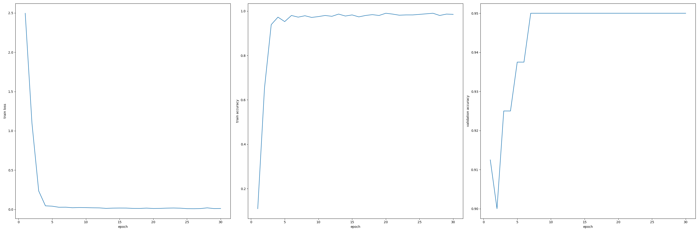
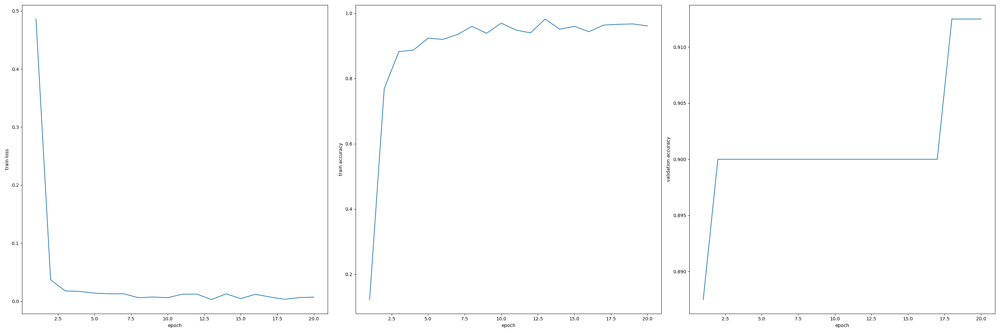
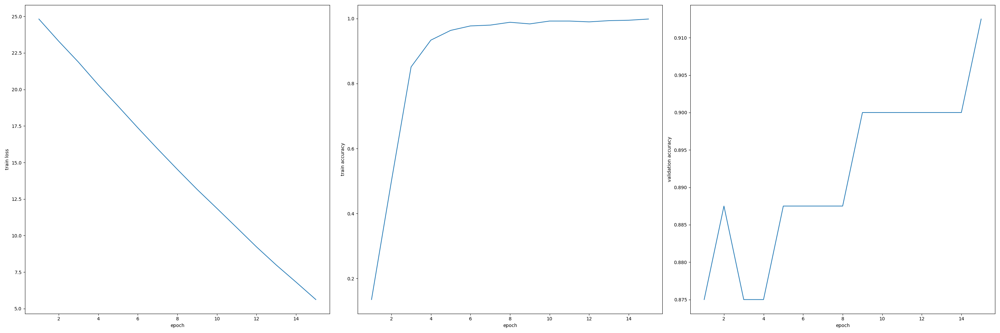

# Progetto computer-vision

Il progetto si occupa del problema della place recognition, in particolare mediante l'utilizzo di descrittori sequenziali ottenuti a partire da sequenze di immagini.

## Selezione dei datasets

I dataset utilizzati per allenare e testare la rete neurale convoluzionale sono selezionati da *Oxford RobotCar Dataset*, una raccolta di immagini scattate da un'automobile appositamente predisposta, dotata di fotocamere, gps e sensori di movimento nel corso di due anni all'interno della città di Oxford. Tra i molteplici datasets della repository ne sono stati selezionati un totale di 8: tre raccolti sul medesimo tragitto (il più lungo tra quelli percorsi dalla vettura), che presentano condizioni di luce e metereologiche differenti, utilizzati per eseguire la fase di train e di validation della cnn, e quattro raccolti su due tragitti minori, non esplorati dal primo percorso, utilizzati per la fase di test.

## Elaborazione dei datasets

Da ogni dataset, composto da circa 45000 immagini nel caso dei percorsi più lunghi, sono state selezionate, mediante codice realizzato appositamente e situato nella cartella *dataset selection* della repository, sequenze di 5 immagini con una distanza percorsa dalla vettura tra due immagini di circa 2 metri e una distanza tra una sequenza e la successiva di circa 10 metri. Ciascuna immagine così ottenuta è poi stata soggetta a downscaling (per arrivare a una risoluzione di 462x320) e passata all'interno della rete preallenata *NetVlad* con lo scopo di ottenere un descrittore delle features dell'immagine (NetVlad è stat scelta in quanto considerata una rete "state of the art" creata appositamente per il place recognition).  

## Rete neurale

I descrittori ottenuti dalle *n* immagini (inseriti in un array di dimensioni *(nx4096)*) sono successivamente mischiati tra loro, mantentendo intatte le sequenze di 5 immagini, e suddivise in due subset destinati a train e validation. Ogni subset contiene a sua volta due set: query e database, ottenuti da immagini differenti della stessa porzione di tragitto; ogni immagine di query ha due immagini corrispondenti all'interno del database acquisite in differenti condizioni meterologiche o di illuminazione.  
Nella fase di train il relativo subset viene caricato dal dataloader nella seguente forma: 
- **1 Query**, prelevata dal query set  
- **2 Positives**, prelevate dal database set e corrispondenti alla medesima porzione di tragitto della query
- **10 Negatives**, prelevate casualmente dal database set
Il tensore così formato viene quindi passato all'interno di una rete neurale convoluzionale che mediante una *1D-convolution* ne ricava un descrittore unico per ogni serie (ovvero un tensore *(1x4096)*), che viene poi normalizzato con una *L2-normalization*. La rete è allenata utilizzando come loss function la *triplet loss*, calcolata su ogni combinazione di query, positivo e negativo, e come optimizer l'algoritmo *Adam*.  
Per la fase di validation vengono poi caricati nella rete tutti i descrittori di query e database presenti nel validation set e calcolata l'accuracy mediante distanza euclidea tra i descrittori globali di ogni serie di immagini restituiti dalla cnn.  
Training e validation viene ripetuto per *n* epoche per poi passare alla fase di test, sostanzialmente identica a quella di validation ma con query e database differenti.  
Tutte le fasi appena descritte sono inserite all'interno di un ciclo di *k-fold cross validation* ripetuto 6 volte con porzioni di dataset differenti per test e validation. Alla fine di ogni epoca il software salva una tabella contenente le coppie di indici delle sequenze individuate come corrispondenti dall'algoritmo nella fase di validation; all'interno del codice è presente anche un file che permette di visualizzare le 10 immagini che compongono tali coppie di sequenze. Dopo ogni fold vengono inoltre salvati il medesimo file riguardante la fase di test e un'immagine rappresentante i grafici di train e validation accuracy e di loss; Infine, ad allenamento concluso, viene creata anche un ulteriore tabella che riassume i risultati ottenuti e parametri come il numero di epoche e i valori inseriti di learning rate dell'optimizer e margin della triplet loss.

## Risultati

Di seguito vengono riportati alcuni dei risultati ottenuti, comprendenti i grafici di train loss, train accuracy e validation accuracy di una fold e la tabella con i principali valori e parametri dell'allenamento.  

|fold|n.epoch|      train loss    |train accuracy|val accuracy|  test accuracy   |t.l. margin|learning reate|NpQ|
|----|-------|--------------------|--------------|------------|------------------|-----------|--------------|---|
| 0  |  30   |0.00677451219962677 |    0.9925    |   0.875    |0.7428571428571429|   0.1     |    1e-05     |10 |
| 1  |  30   |0.012174569909348065|    0.98      |   0.9      |0.8               |   0.1     |    1e-05     |10 |
| 2  |  30   |0.011688556674926076|    0.985     |   0.95     |0.75              |   0.1     |    1e-05     |10 |
| 3  |  30   |0.015954233689626562|    0.98125   |   0.9375   |0.8142857142857143|   0.1     |    1e-05     |10 |
| 4  |  30   |0.013409430876890838|    0.98625   |   0.9      |0.75              |   0.1     |    1e-05     |10 |
| 5  |  30   |0.007473285395917628|    0.99125   |   0.9125   |0.7785714285714286|   0.1     |    1e-05     |10 |

{: width=1850 }

|fold|n.epoch|     train_loss     |train accuracy|val accuracy|  test accuracy   |t.l. margin|learning reate|NpQ|
|----|-------|--------------------|--------------|------------|------------------|-----------|--------------|---|
| 0  |  20   |0.009089142816719686|    0.95875   |   0.875    |0.7642857142857142|   0.01    |    1e-05     |10 |
| 1  |  20   |0.007186415849901095|    0.96125   |   0.9125   |0.7642857142857142|   0.01    |    1e-05     |10 |
| 2  |  20   |0.006201474346198665|    0.96125   |   0.9      |0.7357142857142858|   0.01    |    1e-05     |10 |
| 3  |  20   |0.00386799342913946 |    0.97      |   0.95     |0.7714285714285715|   0.01    |    1e-05     |10 |
| 4  |  20   |0.006053468538084417|    0.96875   |   0.9375   |0.7357142857142858|   0.01    |    1e-05     |10 |
| 5  |  20   |0.007795752151650959|    0.96125   |   0.95     |0.7785714285714286|   0.01    |    1e-05     |10 |

{: width=1850 }

|fold|n.epoch|train_loss          |train_accuracy|val_accuracy|test_accuracy     |t.l.margin|learning_reate|NpQ|
|----|-------|--------------------|--------------|------------|------------------|----------|--------------|---|
|0   |15     |5.577958717942238   |0.99375       |0.8875      |0.7857142857142857|1.0       |1e-05         |10 |
|1   |15     |5.618024468421936   |0.99875       |0.9125      |0.7071428571428572|1.0       |1e-05         |10 |
|2   |15     |5.65602833032608    |0.99375       |0.9         |0.7285714285714285|1.0       |1e-05         |10 |
|3   |15     |5.546883374452591   |0.995         |0.925       |0.75              |1.0       |1e-05         |10 |
|4   |15     |5.6358718276023865  |0.99375       |0.875       |0.7571428571428571|1.0       |1e-05         |10 |
|5   |15     |5.604365482926369   |0.99375       |0.9125      |0.7642857142857142|1.0       |1e-05         |10 |

  
Tutti i grafici e i dati relativi agli esperimenti e alle run effettuate si trovano nella cartella *results* del repository.
